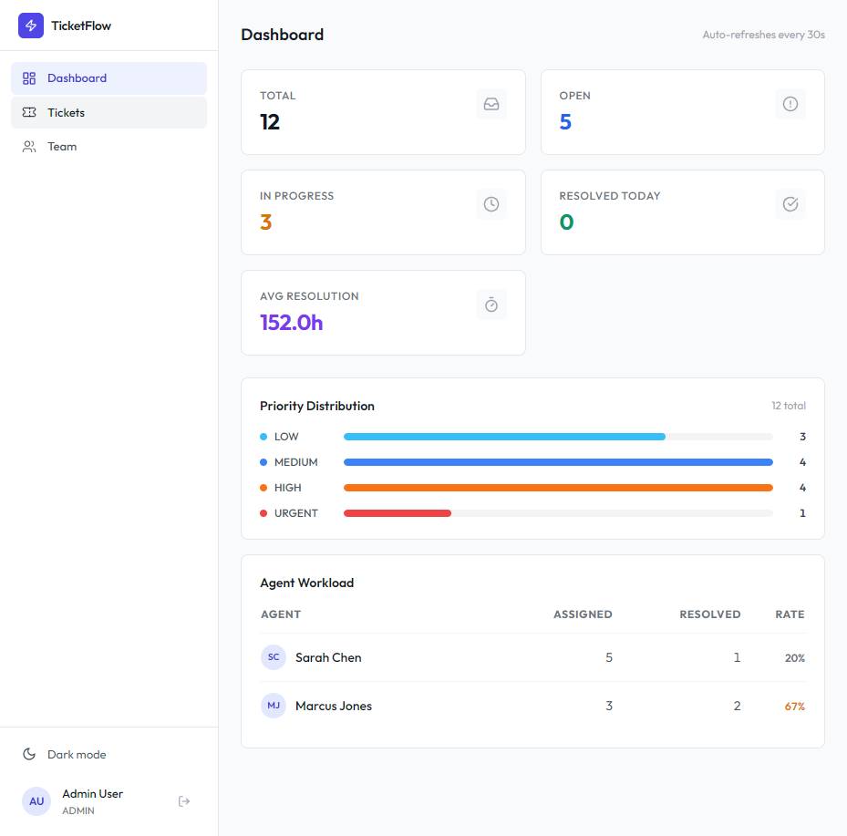
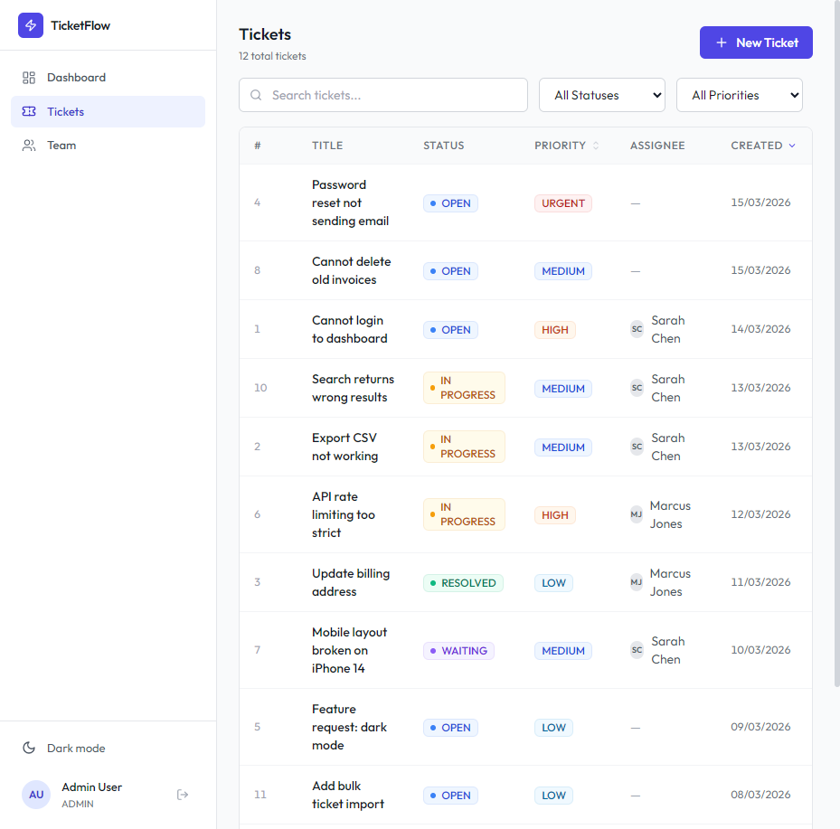
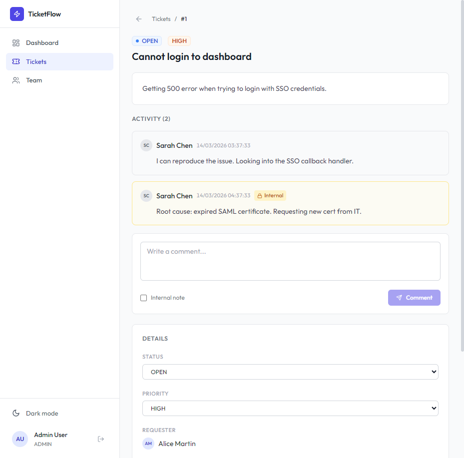

# TicketFlow

Open source self-hosted helpdesk ticketing system for B2B.

## Screenshots

### Dashboard


### Ticket List


### Ticket Detail


## Features

- Ticket management with status, priority, categories, and tags
- Role-based access (Admin, Agent, User)
- Dashboard with KPI stats and agent workload
- Comment system with internal notes for agents
- Team management with role assignment
- Dark / Light mode
- Email notifications (SMTP)
- JWT authentication with refresh tokens
- RESTful API
- Docker Compose deployment

## Tech Stack

- **Backend:** Java 21, Spring Boot 3.3, PostgreSQL 16, Flyway
- **Frontend:** React 18, TypeScript 5, Vite, Tailwind CSS
- **Auth:** JWT (access + refresh tokens)
- **Email:** SMTP with Thymeleaf templates
- **Deploy:** Docker Compose

## Quick Start

### Production (Docker)

```bash
docker compose -f docker-compose.prod.yml up -d --build
```

App runs on `http://localhost:80`.

### Development

```bash
# Start PostgreSQL and Mailhog
docker compose up -d

# Run backend
mvn spring-boot:run

# Run frontend
cd frontend
npm install
npm run dev
```

Backend runs on `http://localhost:8080`, frontend on `http://localhost:5173`.

## Environment Variables

| Variable | Default | Description |
|---|---|---|
| `DB_NAME` | ticketflow | PostgreSQL database name |
| `DB_USER` | ticketflow | PostgreSQL username |
| `DB_PASSWORD` | ticketflow | PostgreSQL password |
| `JWT_SECRET` | (dev default) | JWT signing secret (min 64 chars) |
| `EMAIL_ENABLED` | false | Enable email notifications |
| `SMTP_HOST` | localhost | SMTP server host |
| `SMTP_PORT` | 587 | SMTP server port |
| `APP_PORT` | 80 | Public app port |

## Demo Accounts

| Email | Password | Role |
|---|---|---|
| admin@ticketflow.local | password123 | Admin |
| agent1@ticketflow.local | password123 | Agent |
| user1@ticketflow.local | password123 | User |

## API Endpoints

### Auth
- `POST /api/auth/login` — Login
- `POST /api/auth/register` — Register (admin only)
- `POST /api/auth/refresh` — Refresh token

### Tickets
- `GET /api/tickets` — List (filters: status, priority, assigneeId, page, sortBy)
- `POST /api/tickets` — Create
- `GET /api/tickets/{id}` — Detail
- `PUT /api/tickets/{id}` — Update
- `DELETE /api/tickets/{id}` — Delete (admin only)

### Comments
- `GET /api/tickets/{id}/comments` — List
- `POST /api/tickets/{id}/comments` — Add

### Dashboard
- `GET /api/dashboard/stats` — KPI stats
- `GET /api/dashboard/by-priority` — Count by priority
- `GET /api/dashboard/by-agent` — Agent workload

### Users
- `GET /api/users` — List all users
- `PUT /api/users/{id}/role` — Change role (admin only)

## License

MIT
