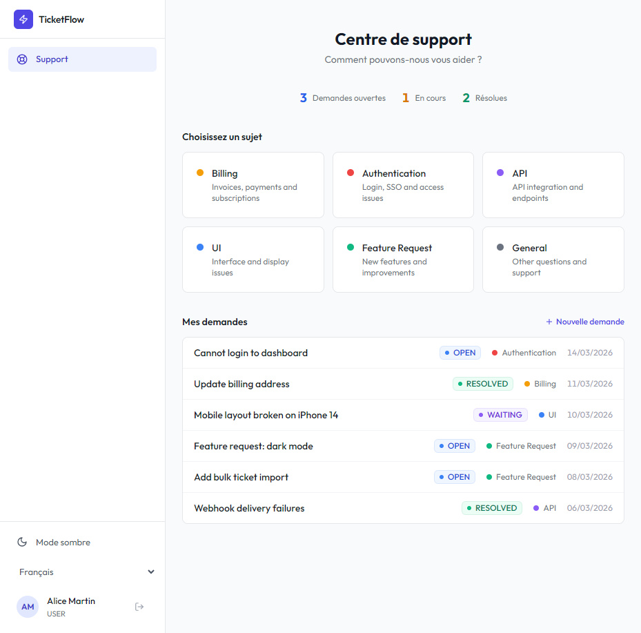
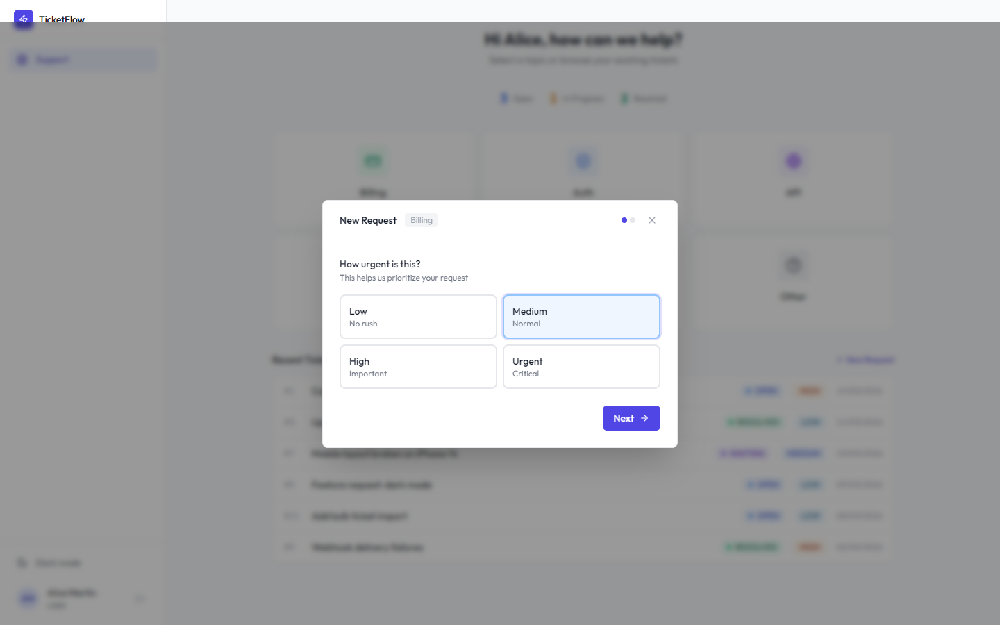
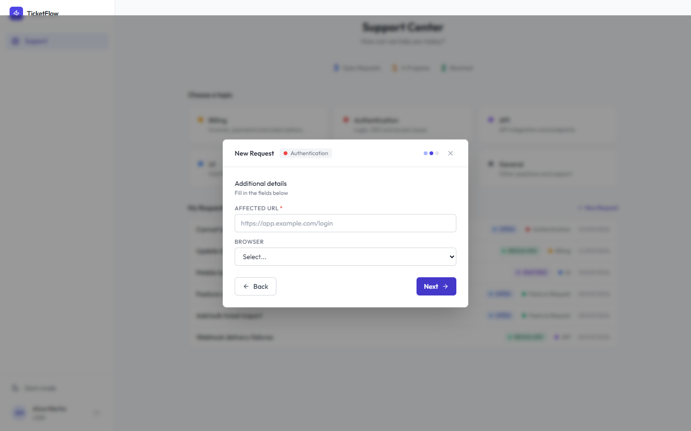
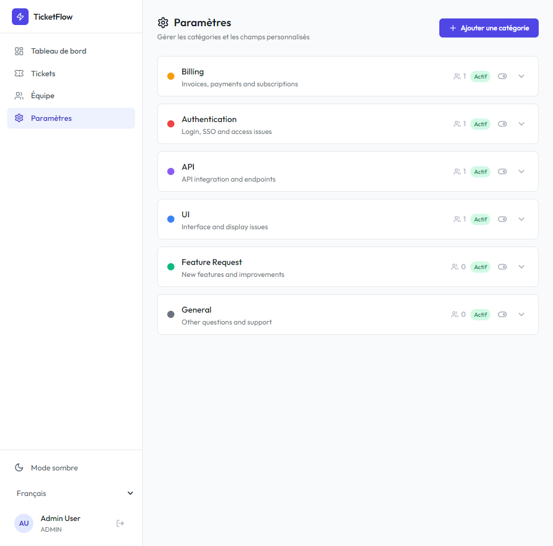
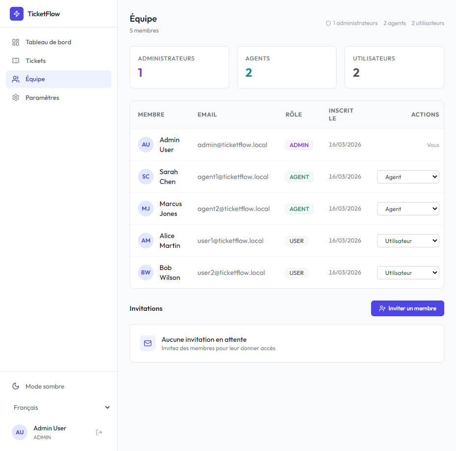
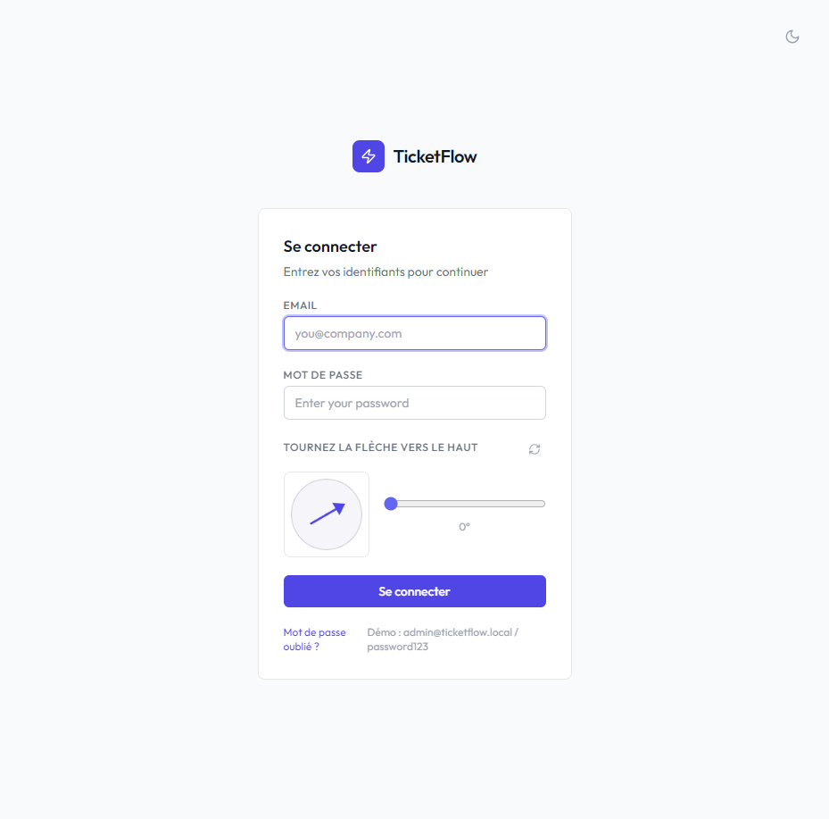

# TicketFlow

Open source self-hosted helpdesk ticketing system for B2B.

## Screenshots

### Dashboard


### Support Center (Client View)


### Ticket List (Staff View)


### Ticket Detail


### Guided Request Creation


### Dynamic Custom Fields


### Category Settings (Admin)


### Team & Invitations


### Login with Puzzle Captcha


## Features

### Service Desk
- Support center for clients with category-based request submission
- Dynamic custom fields per category (text, URL, select, number)
- Guided multi-step request creation wizard
- Client view focused on "My Requests" with status tracking
- Staff ticket management with filtering, sorting, and assignment

### Administration
- Custom categories with colors, icons, and descriptions
- Custom fields per category (required or optional)
- Agent-to-category assignment — agents only see their categories
- Team management with role assignment (Admin, Agent, User)
- Dashboard with KPI stats, priority breakdown, and agent workload

### Security
- **Honeypot** — Hidden field on all auth forms, silent rejection on bot fill
- **Rate limiting (IP)** — Login: 10/min, Register: 5/hour, Forgot password: 3/hour
- **Rate limiting (email)** — Max 3 verification/reset emails per hour per address
- **Puzzle captcha** — Local image rotation challenge, HMAC-signed token, 5 min validity
- **IP account limit** — Max 3 accounts created per day per IP
- **Email verification** — Required when SMTP is configured, auto-verified otherwise
- **Password reset** — Token-based flow with 1 hour expiry

### Registration

Two modes, configurable via `ticketflow.security.public-registration`:

- **Public registration** (`true`) — Anyone can create an account from the login page. All security protections apply (captcha, honeypot, rate limit, IP limit, email verification).
- **Invitation only** (`false`, default) — Admins generate invite links from the Team page. Invited users register via a unique link with pre-assigned role. Links expire after 7 days and can be revoked.

### Internationalization (i18n)

6 languages supported, auto-detected from browser:

- English, Français, Deutsch, Español, Italiano, Português

Language selector in the sidebar. Persisted in localStorage. Zero external dependency.

### General
- Dark / Light mode
- Email notifications (SMTP) with Thymeleaf templates
- JWT authentication with access + refresh tokens
- RESTful API
- Docker Compose deployment

## Tech Stack

- **Backend:** Java 21, Spring Boot 3.3, PostgreSQL 16, Flyway
- **Frontend:** React 18, TypeScript 5, Vite, Tailwind CSS
- **Auth:** JWT (access + refresh tokens)
- **Email:** SMTP with Thymeleaf templates
- **Deploy:** Docker Compose

## Quick Start

### Production (Docker)

```bash
docker compose -f docker-compose.prod.yml up -d --build
```

App runs on `http://localhost:80`.

### Development

```bash
# Start PostgreSQL and Mailhog
docker compose up -d

# Run backend
mvn spring-boot:run

# Run frontend
cd frontend
npm install
npm run dev
```

Backend runs on `http://localhost:8080`, frontend on `http://localhost:5173`.

## Environment Variables

| Variable | Default | Description |
|---|---|---|
| `DB_NAME` | ticketflow | PostgreSQL database name |
| `DB_USER` | ticketflow | PostgreSQL username |
| `DB_PASSWORD` | ticketflow | PostgreSQL password |
| `JWT_SECRET` | (dev default) | JWT signing secret (min 64 chars) |
| `EMAIL_ENABLED` | false | Enable email notifications |
| `SMTP_HOST` | localhost | SMTP server host |
| `SMTP_PORT` | 587 | SMTP server port |
| `APP_PORT` | 80 | Public app port |
| `PUBLIC_REGISTRATION` | false | Allow public account creation |

## Demo Accounts

| Email | Password | Role |
|---|---|---|
| admin@ticketflow.local | password123 | Admin |
| agent1@ticketflow.local | password123 | Agent (Auth, API) |
| agent2@ticketflow.local | password123 | Agent (Billing, UI) |
| user1@ticketflow.local | password123 | User |

## Default Categories

| Category | Description | Custom Fields |
|---|---|---|
| Billing | Invoices, payments and subscriptions | Invoice Number |
| Authentication | Login, SSO and access issues | Affected URL (required), Browser |
| API | API integration and endpoints | Endpoint (required), HTTP Method |
| UI | Interface and display issues | Page URL, Device |
| Feature Request | New features and improvements | — |
| General | Other questions and support | — |

## API Endpoints

### Auth
- `GET /api/auth/config` — Public registration and email status
- `POST /api/auth/login` — Login (honeypot + captcha)
- `POST /api/auth/register` — Register (public, invite, or admin)
- `POST /api/auth/refresh` — Refresh token
- `POST /api/auth/forgot-password` — Request password reset (honeypot + captcha)
- `POST /api/auth/reset-password` — Reset password with token
- `GET /api/auth/verify-email?token=` — Verify email address
- `GET /api/auth/invite/validate?token=` — Validate invitation token
- `GET /api/captcha` — Generate puzzle captcha challenge

### Invitations (admin only)
- `POST /api/invitations` — Create invitation (email + role)
- `GET /api/invitations` — List pending invitations
- `DELETE /api/invitations/{id}` — Revoke invitation

### Categories
- `GET /api/categories` — List active categories
- `GET /api/categories/{id}/fields` — List custom fields for category

### Categories Admin
- `GET /api/admin/categories` — List all categories
- `POST /api/admin/categories` — Create category
- `PUT /api/admin/categories/{id}` — Update category
- `PUT /api/admin/categories/{id}/toggle` — Toggle active
- `PUT /api/admin/categories/{id}/agents` — Assign agents
- `GET /api/admin/categories/{id}/fields` — List all fields
- `POST /api/admin/categories/{id}/fields` — Create field
- `PUT /api/admin/custom-fields/{id}` — Update field
- `PUT /api/admin/custom-fields/{id}/toggle` — Toggle field active
- `DELETE /api/admin/custom-fields/{id}` — Delete field

### Tickets
- `GET /api/tickets` — List (filters: status, priority, assigneeId, categoryId)
- `POST /api/tickets` — Create (with categoryId + customFieldValues)
- `GET /api/tickets/{id}` — Detail (includes custom field values)
- `PUT /api/tickets/{id}` — Update
- `DELETE /api/tickets/{id}` — Delete (admin only)

### Comments
- `GET /api/tickets/{id}/comments` — List
- `POST /api/tickets/{id}/comments` — Add

### Dashboard
- `GET /api/dashboard/stats` — KPI stats
- `GET /api/dashboard/by-priority` — Count by priority
- `GET /api/dashboard/by-agent` — Agent workload

### Users
- `GET /api/users` — List all users
- `PUT /api/users/{id}/role` — Change role (admin only)

## License

MIT
